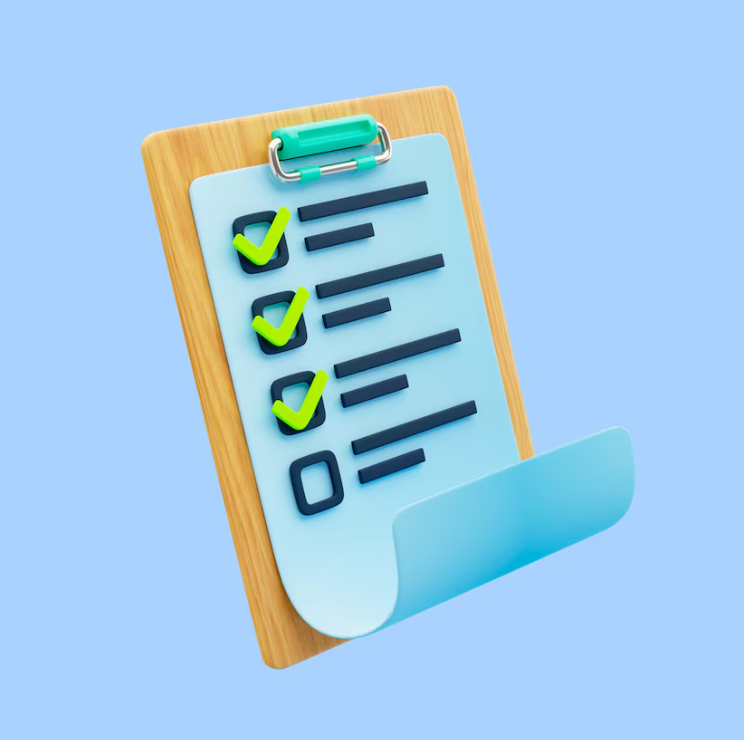
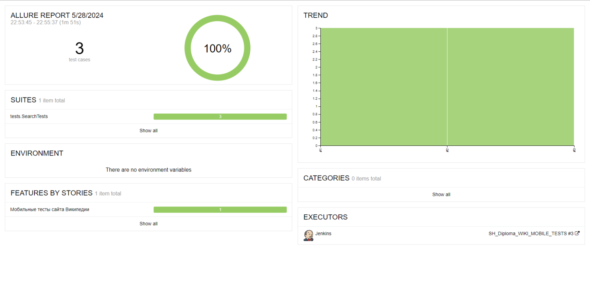
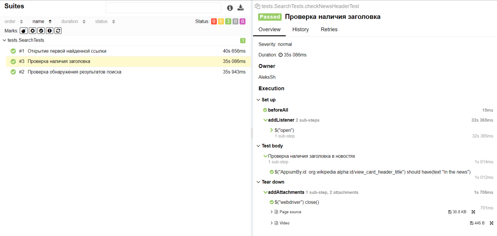
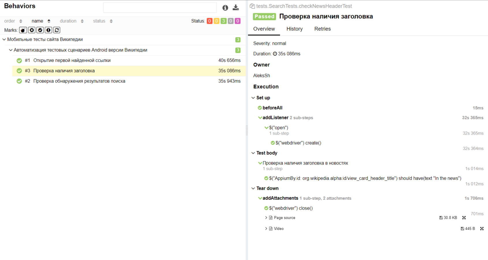
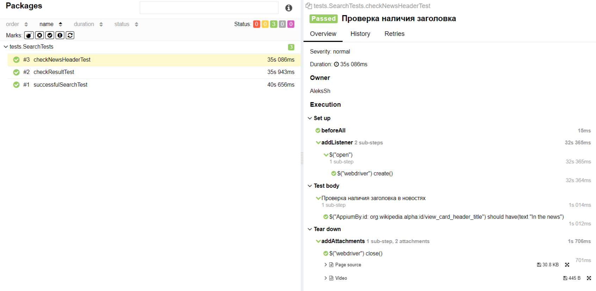
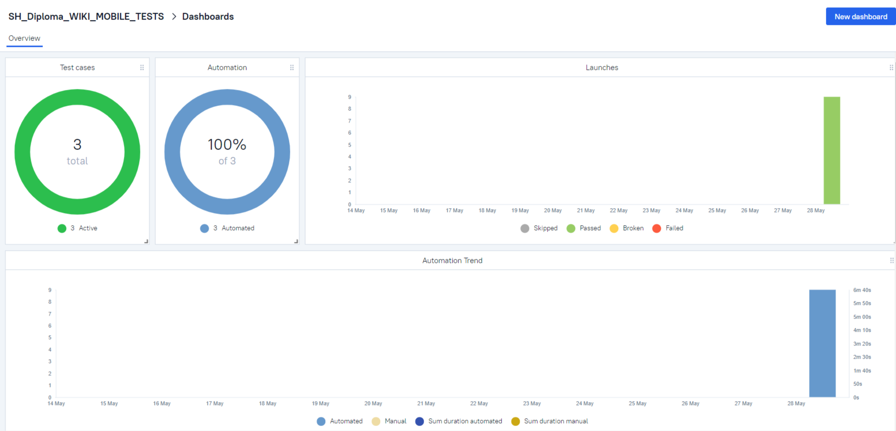
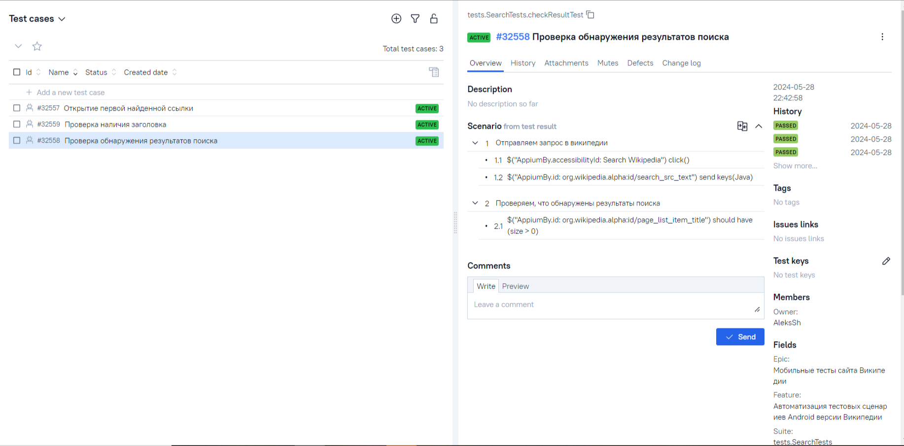
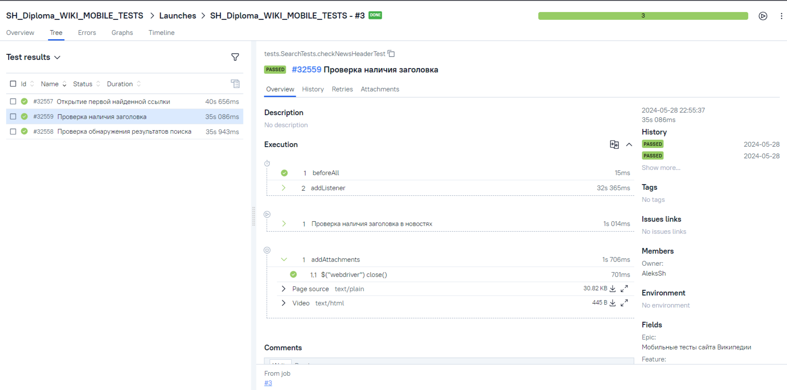
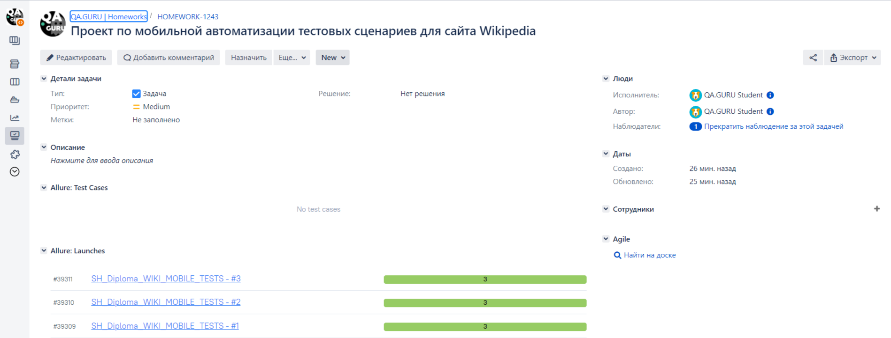

# Проект по мобильной автоматизации тестовых сценариев для сайта Wikipedia

Тесты в проекте написаны на языке <code>Java</code> с использованием фреймворка  [Selenide](https://selenide.org/) и сборщика <code>Gradle</code>. <code>JUnit 5</code> задействован в качестве фреймворка модульного тестирования.
При прогоне тестов для удалённого запуска браузеров используется [Selenoid](https://aerokube.com/selenoid/).
Для удаленного запуска реализована сборка в <code>Jenkins</code> с формированием Allure-отчета и отправкой результатов в <code>Telegram</code> при помощи бота. Также реализована интеграция с <code>Allure TestOps</code> и <code>Jira</code>.


##  Содержание:

- <a href="#tools"> Используемые инструменты</a>
- <a href="#cases"> Тест-кейсы</a>
- <a href="#autotests"> Запуск автотестов</a>
- <a href="#jenkins"> Сборка в Jenkins</a>
- <a href="#allureReport"> Пример Allure-отчета</a>
- <a href="#allure"> Интеграция с Allure TestOps</a>
- <a href="#jira"> Интеграция с Jira</a>
- <a href="#tg"> Уведомления в Telegram с использованием бота</a>
- <a href="#video"> Видео примера запуска тестов в Browserstack</a>

<a id="stech"></a>
##  Используемый стек технологий и инструментов

| Java                                                    | IntelliJ  <br>  Idea                                            | GitHub                                                    | JUnit 5                                                   | Gradle                                                    | Selenide                                                    | Selenoid                                                    | Allure<br/>Report                                                | Allure <br> TestOps                                               | Jenkins                                                    | Jira                                                    |                                                    Telegram |
|:--------------------------------------------------------|-----------------------------------------------------------------|-----------------------------------------------------------|-----------------------------------------------------------|-----------------------------------------------------------|-------------------------------------------------------------|-------------------------------------------------------------|------------------------------------------------------------------|-------------------------------------------------------------------|------------------------------------------------------------|---------------------------------------------------------|------------------------------------------------------------:|
|  |  |  |  |  |  |  |  |  |  |  |  |


<a id="chek"></a>
##   Реализованные проверки
- Проверка открытия нужного сайта
- Проверка языка сайта
- Проверка контактов одного из филиалов компании
- Проверка гамбургер-меню сайта
- Проверка наличия строки поиска
- Проверка наличия адресов социальных сетей

<a id="engine"></a>
##  Запуск автотестов


### Запуск тестов из терминала локально:
```
gradle clean test 
```
### Запуск тестов из терминала удаленно (Selenoid):
```      
gradle clean test -Denv=main
```
### Запуск тестов в Jenkins:
```   
clean test
```

<a id="build"></a>
##  Сборка в Jenkins

Для запуска сборки необходимо перейти в раздел **"Build with Parameters"** и нажать кнопку **"Build"**.
<p align="center">
 
</p>

После выполнения сборки, в блоке **Build History** напротив номера сборки появятся значки 
и  , при клике на которые откроются соответствующие
артефакты.

##  Интеграция с Allure

<a id="report"></a>
### Allure отчет

<p align="center">   
    
</p>

### Подробнее
<p align="center">     
    
</p>       

<p align="center">     
    
</p>  

<p align="center">     
    
</p>  

##  Интеграция с Allure TestOps


<a id="testops"></a>
### Allure TestOps отчет

#### Overview

<p align="center">    

</p>

#### DashBoards
<p align="center">

</p>

#### Подробнее

<p align="center">

</p>


<a id="jira"></a>
##  Интеграция с Jira


<p align="center">

</p>

##  Уведомления в Telegram через бота


<a id="telegram"></a>
<p align="center">

</p>


<a id="video"></a>
##  Видео отчет запуска тестов (Selenoid)

<p align="center">
  
</p>
